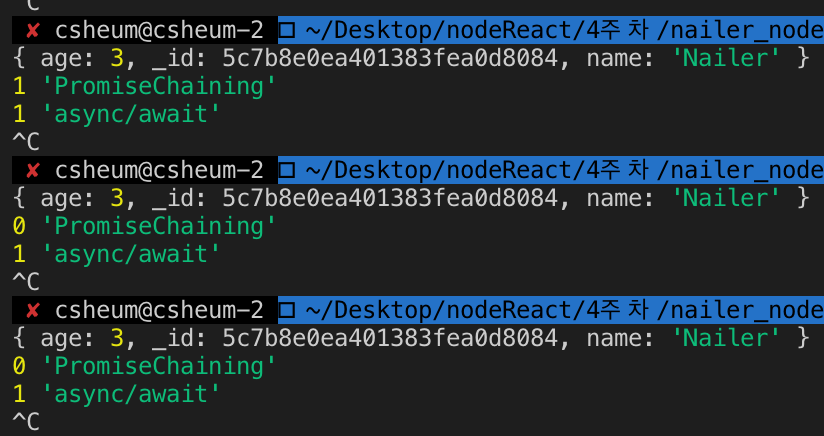

### Promise

-----

> **A promise is an object that may produce a single value some time in the future**

**promise**는 javascript 비동기 처리에 사용되는 **객체**이다.


promise 실습을 위해 다음과 같은 코드를 작성한다.

```javascript
const add = (a, b) => {
  return new Promise((resolve, reject) => {
    setTimeout(() => {
      resolve(a+b)
    }, 2000)
  })
}

add(1, 2)
  .then((sum) => {
    console.log(sum)

    add(sum, 5)
      .then((sum2)=> {
        console.log(sum2)
      })
      .catch(error1 => {
        console.log(error1)
      }) 

  })
  .catch(error => {
    console.log(error)
  })

```


Promise chaining을 통해 더 간결한 코드를 볼 수있다.

```javascript
add(1, 1)
  .then(sum => {
    console.log(sum)
    return add(sum, 4)
  })
  .then(sum2 => {
    console.log(sum2)
  })
  .catch(error => {
    console.log(error)
  })
```


Promise Chaining을 이용한 update 

```javascript
require('../src/db/mongoose')
const User = require('../src/models/user')

User.findByIdAndUpdate('5c7b8e0ea401383fea0d8084', { age: 12 })
  .then(user => {
    console.log(user)
    return User.countDocuments({ age: 12 })
  })
  .then(result => {
    console.log(result)
  })
  .catch(error => {
    console.log(error)
  })
```

정상적으로 작동하지만,

```
DeprecationWarning: collection.findAndModify is deprecated. Use findOneAndUpdate, findOneAndReplace or findOneAndDelete instead.
```

이러한 경고가 발생하는데 


```javascript
mongoose.connect('mongodb://127.0.0.1:27017/task-manager', {
  auth: {
    "authSource": "admin"
  },
  user: 'user',
  password: 'passoword',
  useNewUrlParser: true,
  useFindAndModify: false,
})
```

위와 같이 useFindAndModify 설정을 false로 변경하면 된다.

> 또한, findByIdAndUpdate() method는 update 이전의 원본 document를 return 한다.

task 로 실습해본 promise chaining

```javascript
require('../src/db/mongoose')
const Task = require('../src/models/task')

Task.findByIdAndDelete('5c7b9c3a6e27c7bca66049ac')
  .then(task => {
    console.log(task + ' is deleted')
    return Task.countDocuments({ completed: false })
  })
  .then(numOfTasks => {
    console.log(numOfTasks + ' tasks are not completed')
  })
  .catch(error => {
    console.log(error)
  })

```

결과값

```javascript
{ completed: true,
  _id: 5c7b9c3a6e27c7bca66049ac,
  description: '블로그포스팅하기' } is deleted
11 tasks are not completed
```


### Async / Await

-----

**test 1**

```javascript
const doWork = () => {
  
}

console.log(doWork())

// <result>
// undefined
```


**test 2**

```javascript
const doWork = async () => {
  
}

console.log(doWork())

// <result>
// Promise { undefined }
```

Async에 의해 Promise 객체가 반환되었다.


**test 3**

```javascript
const doWork = async () => {
  return 'Nailer'
}

console.log(doWork())

// <result>
// Promise { 'Nailer' }
```


따라서 항상 async는 Promise 객체를 반환한다고 볼 수 있다.


**test 4**

```javascript
const doWork = async () => {
  return 'Nailer'
}


doWork()
  .then(result => {
    console.log('result', result)
  })
  .catch(error => {
    console.log('error', error)
  })

// <result>
// result Nailer
```

Promise 객체이므로 위와 같이 사용할 수 있다.


**test 5**

```javascript
const add = (a, b) => {
  return new Promise((resolve, reject) => {
    setTimeout(() => {
      resolve(a + b)
    }, 2000)
  })
}

const doWork = async () => {
  const sum = await add(1, 99)
  const sum2 = await add(sum, 50)
  const sum3 = await add(sum2, 3)
  return sum3
}


doWork()
  .then(result => {
    console.log('result', result)
  })
  .catch(error => {
    console.log('error', error)
  })
```


**test 6**

```javascript
const add = (a, b) => {
  return new Promise((resolve, reject) => {
    setTimeout(() => {
      if(a < 0 || b < 0) {
        return reject('numbers must be non-negative')
      }
      resolve(a + b)
    }, 2000)
  })
}

const doWork = async () => {
  const sum = await add(1, 99)
  const sum2 = await add(sum, 50)
  const sum3 = await add(sum2, -3)
  return sum3
}


doWork()
  .then(result => {
    console.log('result', result)
  })
  .catch(error => {
    console.log('error', error)
  })

// <result> 6초 뒤...
// error numbers must be non-negative
```

```javascript

const doWork = async () => {
  const sum = await add(-1, 99)
  const sum2 = await add(sum, 50)
  const sum3 = await add(sum2, -3)
  return sum3
}

// <result> 2초 뒤...
// error numbers must be non-negative
```

첫 번째 await에서 error shooting을 해서 뒤의 await들은 실행되지 않는다.


배운 Promise와 async/await 코드를 혼용할 경우

```javascript
require('../src/db/mongoose')
const User = require('../src/models/user')

User.findByIdAndUpdate('5c7b8e0ea401383fea0d8084', { age: 111 }) 
  .then(user => {                                                
    console.log(user)
    return User.countDocuments({ age: 111 })
  })
  .then(result => {
    console.log(result, 'PromiseChaining')
  })
  .catch(error => {
    console.log(error)
  })

const updateAgeAndCount = async (id, age) => {
  const user = await User.findByIdAndUpdate(id, { age: age })
  const count = await User.countDocuments({age: age})

  return count
}

updateAgeAndCount('5c7b8e0ea401383fea0d8084', 3)
  .then(count => {
    console.log(count, 'async/await')
  })
  .catch(error => {
    console.log(error)
  })
```


이와 같이 개별적으로 하나의 document에 대한 수정을 가했을 때



updateAgeAndCount가 먼저 

```javascript
User.findByIdAndUpdate('5c7b8e0ea401383fea0d8084', { age: 111 }) //The operation returns the original document before the update:
  .then(user => {                                                
    console.log(user)
    return User.countDocuments({ age: 111 })
  })
  .then(result => {
    console.log(result, 'PromiseChaining')
    return updateAgeAndCount('5c7b8e0ea401383fea0d8084', 3)
  })
  .then(count => {
    console.log(count, 'async/await')
  })
  .catch(error => {
    console.log(error)
  })
```

이와 같이 Chaining을 활용한다.


Promise와 async/await를 사용해왔지만, 명확하게 알 수 있는 기회를 가졌다.


