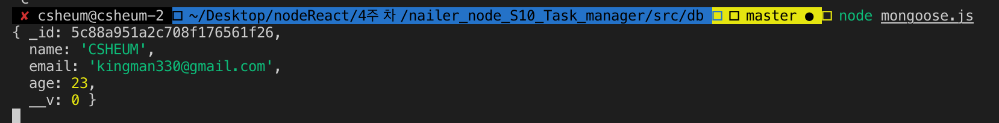
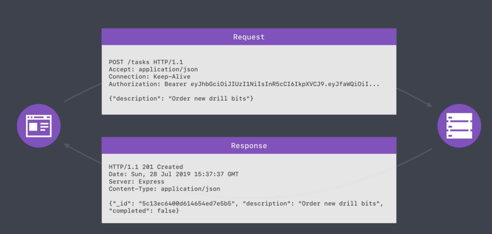
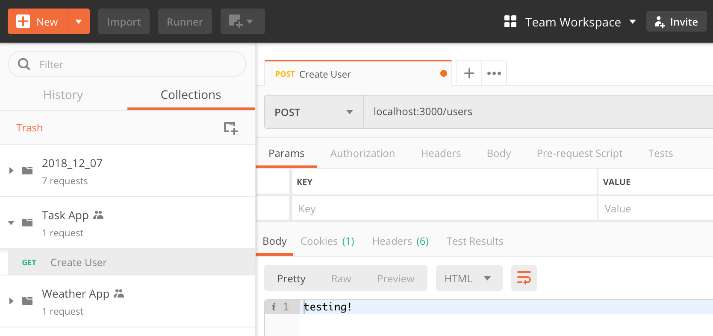
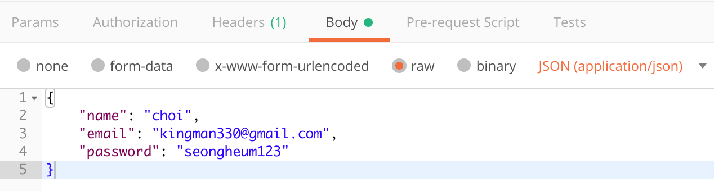

### Mongoose 사용하기

----

Mongoose란 ODM(Object Document Mapper)으로

mySQL을 사용할 때 Sequelize란 ORM(Object Relational Mapper)와 유사한 기능을 한다.


**mongoose.js**

```javascript
const mongoose = require('mongoose')

mongoose.connect('mongodb://127.0.0.1:27017/task-manager', {
  auth: {
    "authSource": "admin"
  },
  user: 'csheum',
  password: 'password',
  useNewUrlParser: true,
})

const User = mongoose.model('User', {
  name: {
    type: String
  }, 
  age: {
    type: Number
  }
})

const me = new User({
  name: 'nailerHeum',
  age: 25,
})

me.save()
  .then(()=> {
    console.log(me)
  })
  .catch((error)=>{
    console.log(error)
  })
```

마찬가지로 권한 문제가 발생했기 때문에 관련 정보를 넣어줘야 한다.

해당하는 attribute에서 지정한 dataType을 넣어주지 않으면 validation error가 발생한다.


Task 하나를 새로 만들어봤다.

```javascript
const newTask = new Task({
  description: '코드스쿼드를 들어간다.',
  completed: true,
})

newTask.save()
  .then(() => {
    console.log(newTask)
  })
  .catch((error) => {
    console.log(newTask)
  })

// 그 결과
{ _id: 5c80c374bb3cdc814e9f0ee9,
  description: '코드스쿼드를 들어간다.',
  completed: true,
  __v: 0 }
```


mongoose로 model의 이름을 설정할 때는 첫글자는 대문자, 단수형으로 생성한다.

mongoose를 통해 생성하면 자동으로 mongoDB에서는 모두 소문자로 바뀌며 복수형으로 만들게 된다.

예를 들어 User라고 생성하면 users로 바뀌는 것이다.


### Data Validation and Sanitization

------

**Data sanitization** is the process of deliberately, permanently, and irreversibly removing or destroying the **data** stored on a memory device. A device that has been **sanitized** has no usable residual **data** and even advanced forensic tools should not ever be able recover erased **data**.


Data Validation을 통해 특정 attribute가 공란일 경우 에러를 돌려주게 만들 수 있다. 

mongoose docs에서 Built-in Validator들을 확인할 수 있다. 

해당 링크 : https://mongoosejs.com/docs/validation.html#built-in-validators


validator.js를 활용해서 편리하게 validation을 적용할 수 있다. 

validate() method를 이용하여  커스터마이징된 validation check 가능

```javascript
email: {
  type: String,
  required: true,
  trim: true,
  lovwercase: true,
  validate(value) {
    if (!validator.isEmail(value)) {
      throw new Error('Invalid Email')
    }
  }
},
```




```javascript
password: {
    type: String,
    required: true,
    trim: true,
    validate(value) {
      if (value.length < 7 || value.includes('password')) {
        throw new Error('Invalid Password')
      }
    }
  },
```

trim : true  옵션은 string의 불필요한 앞뒤 공백을 제거해준다.


###  REST API

------

REST란

> Representational State Transfer

API란

> Application Programming Interface


HTTP method에서 가장 많이 썼던 4가지

> POST, GET, PATCH, DELETE


HTTP Request와 Response에 대한 간단한 예시이다.




### Resource Creation Endpoint

----

```javascript
const express = require('express')

const app = express()
const port = process.env.PORT || 3000

app.post('/users', (req, res) => {
  res.send('testing!')
})

app.listen(port, () => {
  console.log('Server is up on port ' + port)
})

```



postman을 통해 간단하게 post method를 test해봤다.


목적은 유저 생성이기 때문에 Body에 JSON을 넣는다.




이러한 내용을 postman을 통해 넘겨주기로 한다.

```javascript
app.post('/users', (req, res) => {
  console.log(req.body)
  res.send('testing!')
})

//result
Server is up on port 3000
{ name: 'choi',
  email: 'kingman330@gmail.com',
  password: 'seongheum123' }
```

req.body를 통해 넘어온다는 사실을 확인할 수 있다.


models 폴더에 user.js라는 파일을 생성하고 mongoose를 통해 작성한 user model을 따로 담아두고 export시켜 유지보수가 편하도록 한다.


POST /users에 대한 처리를 아래와 같이 추가해준다. 

```javascript
app.post('/users', (req, res) => {
  const user = new User(req.body)

  user.save()
    .then(() => {
      res.send(user)
    })
    .catch(error => {
    	res.send(error)
    })
})
```


성공시에 user를 리턴하므로 아래와 같이 GUID를 포함하여 모든 정보를 돌려보내준다.

```json
{
    "age": 0,
    "_id": "5c8f82e29181482127fcc532",
    "name": "choi",
    "email": "kingman330@gmail.com",
    "password": "seongheum123",
    "__v": 0
}
```


아래와 같이 고의적으로 error를 발생시키는 data를 보내면

```javascript
{
	"name": "choi",
	"email": "kingman330@gmail.com",
	"password": "1234"	// 비밀번호가 너무 짧음
}
```

```json
{
    "errors": {
        "password": {
            "message": "Path `password` (`1234`) is shorter than the minimum allowed length (7).",
            "name": "ValidatorError",
            "properties": {
                "message": "Path `password` (`1234`) is shorter than the minimum allowed length (7).",
                "type": "minlength",
                "minlength": 7,
                "path": "password",
                "value": "1234"
            },
            "kind": "minlength",
            "path": "password",
            "value": "1234"
        }
    },
    "_message": "User validation failed",
    "message": "User validation failed: password: Path `password` (`1234`) is shorter than the minimum allowed length (7).",
    "name": "ValidationError"
}
```

이와 같이 error를 리턴해준다.


https://httpstatuses.com/

> 이 주소는 HTTP STATUS CODE들을 정리되어있는 곳이다.
>
> 각 코드에 대한 자세한 설명 또한 볼 수 있다.

**1xx - Informational**

**2xx - Success**

**3xx - Redirection**

**4xx - Client Error**

**5xx - Server Error**


따라서 위의 request의 경우 client error이므로

res.status(400) 이 적절하다.

(400은 bad request를 의미함)


### Resource Reading Endpoint

----

```javascript
app.get('/users', (req, res) => {
  User.find({})
    .then((users) => {
      res.status(200).send(users)
    })
    .catch(error => {
      res.status(500).send(error)
    })
})

app.get('/users/:id', (req, res) => {
  const _id = req.params.id	// 찾으려는 user의 id를 parameter로 보냈음
  
  User.findById(_id)
    .then((user) => {
      if (!user){
        res.status(404).send()
      }
      res.status(200).send(user)
    })
    .catch(error => {
      res.status(500).send(error)
    })
})
```

단순히 정보를 요청하는 것으로 GET method를 사용하여 users나 

특정 id를 가지고 있는 user를 요청한다. mongoose에 명시되어 있는 method들을 활용하면 좀 더 다양한 방식으로 user를 요청할 수 있다.


프로젝트가 복잡해질수록 다양한 status를 적절하게 표기해주는 것을 중요하게 생각해야 한다.

작년에 했던 프로젝트를 떠올리면서 기초부터 다시 다지는 마음으로 정리해봐야겠다.

