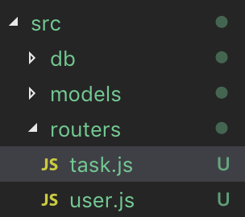

일단 지난 포스팅에서 다뤘던 async/await을 활용하여 실습 프로젝트를 수정하면

```javascript
app.post('/users', async (req, res) => {
  const user = new User(req.body)

  try {
    await user.save()
    res.status(201).send(user)
  } catch(error) {
    res.status(400).send()
  }
})
```

이와 같이 간결하게 고칠 수 있다.


### Resource Updating Endpoint

----

**Updating a User**

```javascript
app.patch('/users/:id', async (req, res) => {
  const updates = Object.keys(req.body)
  const allowedUpdates = ['name', 'email', 'password', 'age' ] 
  const isValidOperation = updates.every(update => allowedUpdates.includes(update))

  if(!isValidOperation) {
    return res.status(400).send({ error: 'Invailid Updates' })
  }
  try {
    const user = await User.findByIdAndUpdate(req.params.id, req.body, { new: true, runValidators: true })
    if (!user) {
      return res.status(404).send()
    }
    res.status(202).send(user)
  } catch (error) {
    res.status(400).send(error)
  }
})
```

`const updates = Object.keys(req.body)`

**`Object.keys()`**는 `object`에서 key값들에 대응하는 문자열들을 요소로 갖는 배열을 반환한다. 반환된 요소는 loop문을 실행할 때 주어지는 순서와 동일하다.


`const isValidOperation = updates.every(update => allowedUpdates.includes(update))`


**Array.prototype.every()**

The `every()` method tests whether all elements in the array pass the test implemented by the provided function. (전부 true일 경우에만 true)


[findByIdAndUpdate() docs](https://mongoosejs.com/docs/api.html#model_Model.findOneAndUpdate)

위에서 사용한 두 가지 옵션 new와 runValidators는

- **`new`:** bool - if true, return the modified document rather than the original. defaults to false (option이 없을 때는 original document를 ruturn했음)
- **`runValidators`:** if true, runs [update validators](https://mongoosejs.com/docs/validation.html#update-validators) on this command. Update validators validate the update operation against the model's schema.


### Resource Deletion Endpoint

----

```javascript
app.delete('/users/:id', async (req, res) => {
  
  try {
    const user = await User.findByIdAndDelete(req.params.id)
    if(!user) {
      res.status(404).send()
    }
    res.status(200).send(user)
  } catch (error) {
    res.status(500).send()
  }
})
```

user가 없을경우 404 not found로 처리

error일 경우 500 internal server error 코드를 보내준다.

비교적 간단한 코드로 해낼 수 있다.


이러한 모든 요청들을 index.js 하나의 파일에 그 처리를 작성하면 유지보수를 하기 어렵다.


그래서 express.Router를 활용해서 refactoring을 진행한다.


깔끔해진 index.js

```javascript
const express = require('express')
require('./db/mongoose')

const userRouter = require('./routers/user')
const taskRouter = require('./routers/task')

const app = express()
const port = process.env.PORT || 3000

app.use(express.json()) // json을 자동으로 parse해준다.
app.use(userRouter)
app.use(taskRouter)


app.listen(port, () => {
  console.log('Server is up on port ' + port)
})

```



routers 폴더안에 정리하고

```javascript
const express = require('express')
const router = new express.Router()
const User = require('../models/user')

router.get('/test', (req, res) => {
  res.send('This is user.js test')
})
```

이러한 방식으로 정리하면 된다.


### Related Posts

- [Node-RESTful API (1)](/posts/Node-RESTful-API-1/)

  
