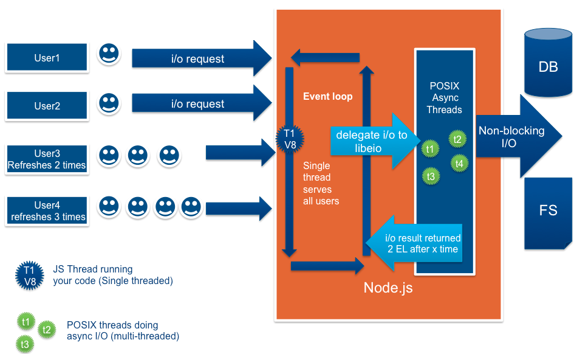

## Node.js란 무엇일까?

----

### Node.js의 정의

**An asynchronous event driven Javascript runtime to build scalable network applications**

확장성 있는 네트워크 어플리케이션을 만들기 위한 비동기적이고 event driven의 runtime environment이다.

Runtime environment는 runtime library, runtime system을 포함하는 Runtime에 필요한 전반적인 것들을 포함하고 있다.


### Node.js의 구조



[nodejs architecture 출처](https://codeburst.io/how-node-js-single-thread-mechanism-work-understanding-event-loop-in-nodejs-230f7440b0ea)

위의 그림처럼 유저들의 모든 요청을 Single thread의 Event loop로 처리한다. 하지만 뒤 쪽의 worker thread들도 분명 존재한다. 이 thread들은 event loop가 위임해준 일들을 받아 처리한다. 

"**Libuv**" 라이브러리는 이 thread들이 OS kernel과 협동하도록 만든다. 

Kernel에서 thread들이 처리하는 일이 끝나면 Node.js 에 이를 알려서 적절한 처리를 이후에 실행할 수 있도록 한다.

```
   ┌───────────────────────────┐
┌─>│           timers          │
│  └─────────────┬─────────────┘
│  ┌─────────────┴─────────────┐
│  │     pending callbacks     │
│  └─────────────┬─────────────┘
│  ┌─────────────┴─────────────┐
│  │       idle, prepare       │
│  └─────────────┬─────────────┘      ┌───────────────┐
│  ┌─────────────┴─────────────┐      │   incoming:   │
│  │           poll            │<─────┤  connections, │
│  └─────────────┬─────────────┘      │   data, etc.  │
│  ┌─────────────┴─────────────┐      └───────────────┘
│  │           check           │
│  └─────────────┬─────────────┘
│  ┌─────────────┴─────────────┐
└──┤      close callbacks      │
   └───────────────────────────┘
```

[nodejs.org](https://nodejs.org/en/docs/guides/event-loop-timers-and-nexttick/)

Event Loop의 phase들을 간단하게 표현하였다.

각 phase들은

- **timers** : setTimeout()이나 setInterval()에 의한 callback들을 실행한다.
- **pending callbacks** : 다음 loop때 실행하기로 했던 I/O callback들을 실행한다.
- **idle, prepare** : 내부적으로만 사용한다..
- **poll** : 새로운 I/O event들을 갖고 오며, I/O 관련 callback들을 실행한다. (대부분의 callback들이 여기서 실행된다.)
- **check** : setImmediate() callback들이 호출된다.
- **close callbacks** : close callback들을 수행한다.

위 phase들을 계속해서 반복하며 요청들을 처리한다.


## Node.js의 contents

어플리케이션을 만드는데 필요한 굉장히 많은 기능들을 제공해준다.

모든 contents들을 자세히 살펴보기엔 너무나 많기 때문에 각 요소들의 요약만을 정리했다.

- **Assertion Testing**

  **`assert`** 모듈은 변하지 않는다는 것을 테스트하기 위한 간단한 단언 테스트들을 제공한다. `strict` 와 `legacy` 모드가 제공되는데 `strict mode` 만 사용할 것이 권장된다.

- **Async Hooks**

  **`async_hooks`** 모듈은 특정 callback들을 등록하는 API를 제공한다. 그 callback들은 Node.js app 내부에서 생성된 비동기적인 리소스들의 수명을 추적하는 역할을 한다.

- **Buffer**

  Node.js API인 **`Buffer`** Class는 TCP stream의 octet stream들과 file system operation들 그리고 다른 context들의 상호작용을 가능하게 만들어준다.Buffer class는 정수형의 배열들과 비슷하지만, size가 고정되어있고 V8 엔진의 heap 외부의 raw memory 할당에 부합한다.

- **C++ Addons**

  Node.js와 C/C++ library 들의 interface를 제공해준다. 이를 통해 일반 Node.js module처럼 C++로 작성된 객체들을 require()를 통해 사용할 수 있게 해준다.

- **N-API**

  native Addon들을 만들기 위한 API이다. 

- **Child Process**

  **`child_process`** module은 child process를 생성하기 위한 module이다. 기본적으로 parent process와 child process의 stdin, stdout 그리고 stderr에 대한 pipe들을 제공해준다.

- **Cluster**

  `cluster` module은 server port들을 child process들의 생성을 쉽게 만들어준다.

- **CLI options**

  말 그대로 CLI option들에 대한 설명이다.

- **Console**

  **`console`** module은 web browser와 비슷한 debugging console을 제공한다.

- **Crypto**

  OpenSSL에서 제공하는 암호화 기능을 포함하는 다양한 암호화 기능들을 제공해준다.

- **Debugger**

  process 밖에서 접근할 수 있는 debugging utility를 포함한다.

  실행시키고 싶다면 node inspect <파일명>을 하면 된다.

- **DNS**

  dns와 관련된 것들을 처리할 수 있는 기능들을 갖는다.

- **Errors**

  Node.js의 모든 javascript 와 system error들은 javascript Error class에 있다.

- **Events**

  특정 event들을 emit해서 listener들이 해당 event에 대한 행동을 취하게 만드는 객체를 갖고있다. EventEmitter Class를 확장해서 사용한다.

- **File System**

  **`fs`** module은 표준 POSIX 기능들에 가깝게 모델링된 file system과 상호작용하는 API를 제공한다.

- **Global Objects**

  모든 모듈에서 사용이 가능한 객체들이다. 

  `Buffer, __dirname, __filename ` 등 

- **HTTP, HTTP/2, HTTPs**

  http protocol을 사용하기 위한 객체

- **Inspector**

  V8 inspector와 상호작용하기 위한 API

- **Internationalization**(i18n)

  국제화를 위한 다양한 옵션들을 제공해준다.

- **Modules**

  module들에 대한 전반적인 설명들

- **Net**

  stream기반 TCP나 IPC server나 client들을 생성하기 위한 비동기 네트워크 API를 제공한다.

- **OS**

  운영체제와 관련된 utility method들을 많이 제공한다.

- **Path**

  file과 directory path들과 관련된 업무를 수행할때 utility들을 제공해준다.

- **Performance Timing API**

  성능 관련 정보에 대한 API

- **Process**

  **`process`** 는 글로벌 객체로 현재 node.js process에 대한 정보와 전반적인 조작을 제공해준다.

- **Query String**

  querystring module은 URL query string들을 parsing하고 formatting하는데 필요한 utility들을 제공한다.

- **Readline**

  readline module은 한번에 한 줄씩 읽을 수 있는 stream으로 부터 data들을 읽는 interface를 제공한다.

- **REPL**

  repl module은 **Read-Eval-Print-Loop** (unix shell처럼 사용자가 커맨드를 입력하고 상호작용하는)을 하게 해준다.

- **Stream**

  stream은 node.js에서 streaming data를 다루는 추상적인 interface이다. 

  stream module은 stream interface를 구성하는 객체들을 쉽게 만들기 위한 API이다.

- **String Decoder**

  **`string_decoder`** module은 buffer 객체들을 string으로 복호화하는 것을 위한 API이다. 

- **Timers**

  **`timer`** module은 global API이다. scheduling 기능들을 갖고있다. 예를 들어 setTimeout과 같은 method들을 갖고 있다.

- **Table of Contents**

  **`tls`** module은 `Transport Layer Security(TLS)` 와 `Secure Socket Layer (SSL)` protocol들의 수행들을 제공한다.

- **Trace Events**

  V8, Node.js core와 userspace code에 의해 생성된 정보들의 추적을 중앙화하는 메카니즘을 제공한다.

- **TTY**

  **`tty`** module은 `tty.ReadStream` 과 `tty.WriteStream` class들을 제공한다. 터미널 세션과 관련된 module이다.

- **UDP/Datagram sockets**

  **`dgram`** module은 UDP Datagram socket에 대한 수행을 제공한다.

- **URL**

  **`url`** module은 URL resolution과 parsing에 대한 utility들을 제공한다.

- **Utilities**

  **`util`** module은 내부 API들의 요구사항을 지원하기 위한 utility들을 제공한다.

- **V8**

  **`v8`** 모듈은 Node.js에 내장된 V8의 API들을 노출시킨다.

- **VM**

  **`vm`** module은 V8 버츄얼머신 context들의 code를 컴파일하고 실행시키는 API를 제공한다.

- **Worker Threads**

  **`worker`** module은 독립적인 thread들에 다중 환경을 생성하는 방법을 제공한다.

- **Zlib**

  파일 압축 기능을 제공한다.


### 마무리

이렇게 하나하나 찾아보면서 여전히 어떤 역할을 하는지 모르는 module들도 있었고, 매우 유용하게 사용할 것 같은 module들도 있었다. node.js가 무엇인지 알아보는 계기가 되었다. 이후 Node.js에 대해서 궁금한 점들을 알아나가겠다.


 