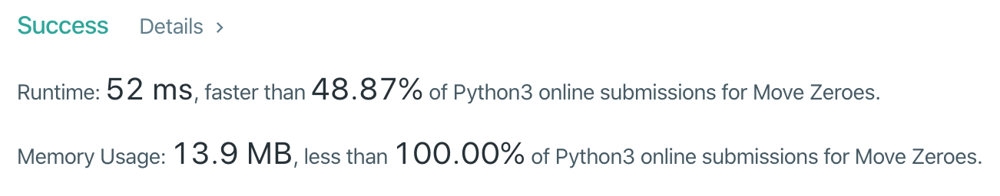

---

[문제 링크](https://leetcode.com/problems/move-zeroes/)


#### 접근 (의식의 흐름)

아래 두 조건이 신경쓰였지만 그냥 `filter` 함수를 사용하고 기존 길이에서 부족한 만큼 0으로 채우는 방법을 사용하려 했어요. 하지만 역시 filter는 새로운 array를 만들어주기 때문에 문제 조건을 만족시키지 못했어요.

`문제조건`

```
1. You must do this in-place without making a copy of the array.
2. Minimize the total number of operations.
```

결국 완전 탐색을 하며 0인 경우 삭제하고, 몇 개 삭제했는지 기억해두고 나중에 뒤에 붙여주는 방식으로 문제를 풀었어요.


#### 코드

```python
class Solution:
    def moveZeroes(self, nums: List[int]) -> None:
        idx = 0
        zerocounter = 0
        while idx < len(nums):
            if nums[idx] == 0:
                del nums[idx]
                zerocounter += 1
                continue
            idx += 1
        nums += [0]*zerocounter
```




무난하지만 성능 향상에 대해서 좀 더 공부가 필요한 것 같아요.