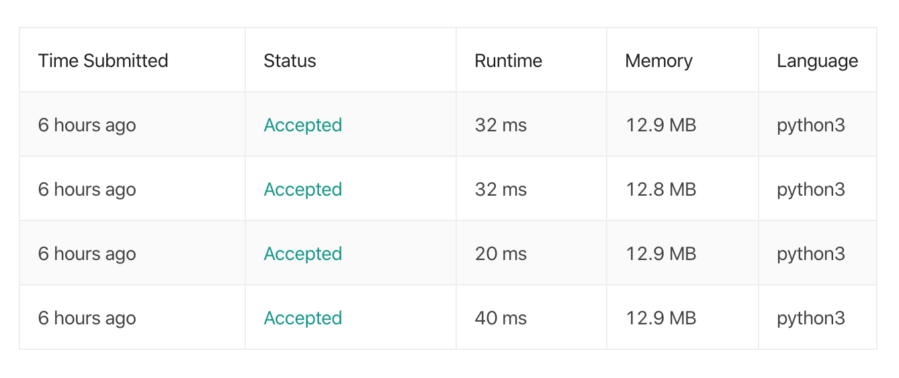

프로그래머스에서 주로 상주하고 문제를 풀다가 leetcode의 문제들을 매일 제시하고 푸는 카톡방에 들어온 김에 풀이를 써보려고 해요. 꾸준했으면 좋겠어요!

[문제 링크](https://leetcode.com/problems/subsets/)


#### 접근 (의식의 흐름)

값이 모두 다른 배열의 모든 부분 집합을 돌려주는 method를 작성하는 문제에요.

python에는 `itertools` 에서 `combinations` 를 사용해서 푸는 방법을 제일 먼저 떠올렸고,

작성한 코드가 통과했어요. 그런데 다른 사람들의 답을 보니 라이브러리를 사용하지 않은 답들이 많아서

`reduce` 만 사용했어요. 덕분에 전체 4줄 짜리 코드로 통과했어요.


#### 코드

```python
from functools import reduce
class Solution:
    def subsets(self, nums: List[int]) -> List[List[int]]:
        return reduce(lambda x, y: x + [i + [y] for i in x], nums, [[]])
```




성능에서는 큰 차이가 없었어요.

