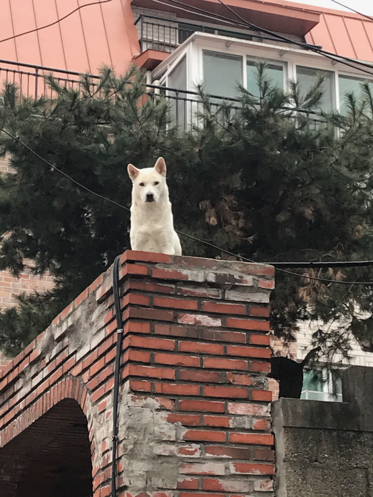

타의적으로 못생긴 Hexo를 버리고 자의적으로 못생긴 Gatsby를 채택했어요.

이 글은 첫 글이에요.

쓸 말이 없군요. 잘 나오나 테스트나 하려구요.

----

### 세번째로 큰 헤딩!

*굵은 글씨*

역시 마크다운은 타이포라가 짱이에요.



```
hi dengdeng
```

Gatsby 블로그를 만드는 방법에 대한 친절한 가이드를 작성해주신 순호쟝에게 감사를...!

[순호형의 가이드 링크](https://github.com/snowjang24/gatsby-practice)